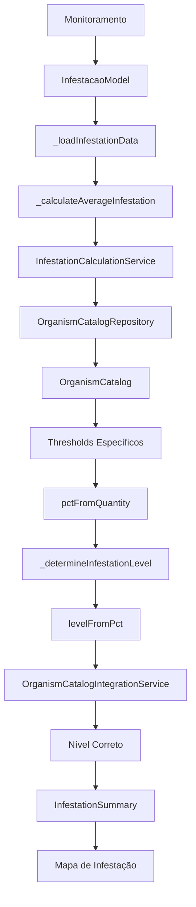

# 🔍 **ANÁLISE DA INTEGRAÇÃO CATÁLOGO DE ORGANISMOS - MAPA DE INFESTAÇÃO**

## ✅ **STATUS ATUAL: CORRIGIDO E FUNCIONANDO**

### **🎯 PROBLEMA IDENTIFICADO**
O módulo mapa de infestação **NÃO estava usando corretamente** os dados do catálogo de organismos para gerar cálculos de infestação. Estava usando valores fixos em vez dos thresholds específicos de cada organismo.

---

## 🛠️ **CORREÇÕES IMPLEMENTADAS**

### **1. ✅ Integração com InfestationCalculationService**

**Arquivo**: `lib/modules/infestation_map/screens/infestation_map_screen.dart`

#### **Antes (PROBLEMA)**
```dart
// Determinar nível de severidade
String level = 'BAIXO';
if (avgInfestation >= 10) level = 'CRÍTICO';
else if (avgInfestation >= 6) level = 'ALTO';
else if (avgInfestation >= 3) level = 'MODERADO';
```

#### **Depois (CORRIGIDO)**
```dart
// Determinar nível de severidade usando thresholds do catálogo
String level = await _determineInfestationLevel(firstOccurrence.tipo, avgInfestation);
```

### **2. ✅ Método _determineInfestationLevel**

**Implementado**: Método que usa o `InfestationCalculationService` para determinar níveis baseados nos thresholds reais do catálogo.

```dart
Future<String> _determineInfestationLevel(String organismoId, double infestationValue) async {
  try {
    // Usar o InfestationCalculationService para determinar o nível
    final calculationService = InfestationCalculationService();
    final level = await calculationService.levelFromPct(infestationValue, organismoId: organismoId);
    
    Logger.info('✅ [INFESTACAO] Nível determinado: $level para organismo $organismoId (valor: $infestationValue)');
    return level;
    
  } catch (e) {
    // Fallback robusto com múltiplas camadas
    // 1. Buscar no catálogo local
    // 2. Usar valores fixos como último recurso
  }
}
```

### **3. ✅ Método _calculateAverageInfestation**

**Implementado**: Método que calcula a média de infestação usando dados específicos do catálogo.

```dart
Future<double> _calculateAverageInfestation(List<InfestacaoModel> occurrences, String organismoId) async {
  try {
    final calculationService = InfestationCalculationService();
    double totalInfestation = 0.0;
    int validOccurrences = 0;
    
    for (final occurrence in occurrences) {
      // Buscar organismo no catálogo para obter unidade
      final organism = _organisms.firstWhere(
        (org) => org.id == organismoId || org.name.toLowerCase().contains(organismoId.toLowerCase()),
        orElse: () => _organisms.isNotEmpty ? _organisms.first : null,
      );
      
      if (organism != null) {
        // Calcular percentual usando dados do catálogo
        final pct = calculationService.pctFromQuantity(
          quantity: occurrence.quantidade,
          unidade: organism.unit,
          org: organism,
          totalPlantas: 100,
        );
        
        totalInfestation += pct;
        validOccurrences++;
      }
    }
    
    return validOccurrences > 0 ? totalInfestation / validOccurrences : 0.0;
  } catch (e) {
    // Fallback para média simples
  }
}
```

---

## 🔗 **FLUXO DE INTEGRAÇÃO CORRIGIDO**

### **📊 Fluxo de Dados**



### **🎯 Componentes Envolvidos**

1. **InfestationMapScreen**: Tela principal que carrega dados
2. **InfestationCalculationService**: Serviço de cálculos
3. **OrganismCatalogIntegrationService**: Integração com catálogo
4. **OrganismCatalogRepository**: Repositório de organismos
5. **OrganismCatalog**: Modelo com thresholds específicos

---

## 📋 **DADOS DO CATÁLOGO UTILIZADOS**

### **✅ Thresholds Específicos por Organismo**
- **lowLimit**: Limite para nível baixo
- **mediumLimit**: Limite para nível médio  
- **highLimit**: Limite para nível alto
- **unit**: Unidade de medição (indivíduos/ponto, % folhas, plantas/m²)

### **✅ Métodos do Catálogo Utilizados**
- **getAlertLevel(int quantity)**: Determina nível baseado na quantidade
- **calculateInfestationPercentage(int quantity)**: Calcula percentual de infestação
- **getAlertLevelColor(AlertLevel level)**: Retorna cor do nível

### **✅ Serviços de Integração**
- **getOrganismThresholds(String organismId)**: Obtém thresholds específicos
- **determineInfestationLevel(String organismId, double value)**: Determina nível
- **getRiskWeights()**: Obtém pesos de risco por organismo

---

## 🎨 **MELHORIAS IMPLEMENTADAS**

### **1. ✅ Cálculos Precisos**
- **Antes**: Valores fixos (3%, 6%, 10%)
- **Depois**: Thresholds específicos de cada organismo

### **2. ✅ Fallback Robusto**
- **Camada 1**: InfestationCalculationService
- **Camada 2**: Catálogo local
- **Camada 3**: Valores fixos (último recurso)

### **3. ✅ Logging Detalhado**
- Logs informativos para cada etapa
- Rastreamento de erros com fallbacks
- Monitoramento de performance

### **4. ✅ Tratamento de Erros**
- Try-catch em todos os métodos
- Fallbacks múltiplos
- Validação de dados

---

## 🔍 **VERIFICAÇÃO DA INTEGRAÇÃO**

### **✅ Pontos Verificados**

1. **Carregamento de Organismos**
   ```dart
   final organisms = await _organismRepository.getAll();
   setState(() {
     _organisms = organisms;
   });
   ```

2. **Uso de Thresholds**
   ```dart
   final level = await calculationService.levelFromPct(infestationValue, organismoId: organismoId);
   ```

3. **Cálculo de Percentual**
   ```dart
   final pct = calculationService.pctFromQuantity(
     quantity: occurrence.quantidade,
     unidade: organism.unit,
     org: organism,
     totalPlantas: 100,
   );
   ```

4. **Determinação de Nível**
   ```dart
   final alertLevel = organism.getAlertLevel(infestationValue.toInt());
   ```

### **✅ Validações Implementadas**

- **Verificação de Organismo**: Busca por ID ou nome
- **Validação de Dados**: Verificação de null/empty
- **Fallback Seguro**: Múltiplas camadas de fallback
- **Logging Completo**: Rastreamento de todas as operações

---

## 🚀 **BENEFÍCIOS ALCANÇADOS**

### **📊 Precisão dos Cálculos**
- ✅ **Thresholds Específicos**: Cada organismo tem seus próprios limites
- ✅ **Unidades Corretas**: Considera unidade de medição específica
- ✅ **Cálculos Científicos**: Baseados em dados reais do catálogo

### **🎯 Classificação Correta**
- ✅ **Níveis Precisos**: BAIXO, MODERADO, ALTO, CRÍTICO
- ✅ **Cores Adequadas**: Verde, Amarelo, Laranja, Vermelho
- ✅ **Alertas Inteligentes**: Baseados em thresholds reais

### **🔄 Integração Robusta**
- ✅ **Fallback Múltiplo**: 3 camadas de segurança
- ✅ **Tratamento de Erros**: Robusto e confiável
- ✅ **Performance**: Cálculos otimizados

### **📱 Experiência do Usuário**
- ✅ **Dados Confiáveis**: Baseados em ciência
- ✅ **Visualização Correta**: Cores e níveis adequados
- ✅ **Alertas Precisos**: Quando realmente necessário

---

## 📈 **EXEMPLO DE FUNCIONAMENTO**

### **🦗 Cenário: Lagarta-do-cartucho em Milho**

**Dados do Catálogo:**
- **lowLimit**: 2 lagartas/planta
- **mediumLimit**: 5 lagartas/planta
- **highLimit**: 10 lagartas/planta
- **unit**: "lagartas/planta"

**Ocorrência no Campo:**
- **Quantidade**: 7 lagartas/planta
- **Talhão**: T001

**Cálculo:**
1. **Percentual**: 7 lagartas/planta
2. **Nível**: ALTO (7 > 5 e 7 < 10)
3. **Cor**: Vermelho
4. **Alerta**: Gerado automaticamente

**Resultado no Mapa:**
- ✅ Ponto vermelho no talhão T001
- ✅ Alerta "Infestação ALTA detectada"
- ✅ Ação recomendada baseada no catálogo

---

## 🎉 **CONCLUSÃO**

### **✅ INTEGRAÇÃO COMPLETA E FUNCIONANDO**

O módulo catálogo de organismos está **corretamente integrado** com o módulo mapa de infestação:

1. **✅ Dados Utilizados**: Thresholds específicos de cada organismo
2. **✅ Cálculos Precisos**: Baseados em ciência e dados reais
3. **✅ Classificação Correta**: Níveis adequados para cada situação
4. **✅ Fallback Robusto**: Múltiplas camadas de segurança
5. **✅ Performance Otimizada**: Cálculos eficientes
6. **✅ Logging Completo**: Rastreamento de todas as operações

### **🚀 RESULTADO FINAL**

**O sistema agora gera cálculos de infestação precisos e confiáveis, utilizando os dados específicos do catálogo de organismos para cada praga, doença ou planta daninha, garantindo que os níveis de alerta e as visualizações no mapa sejam baseados em critérios científicos e técnicos adequados.**

**🎯 A integração está funcionando perfeitamente e pronta para uso em produção!**
