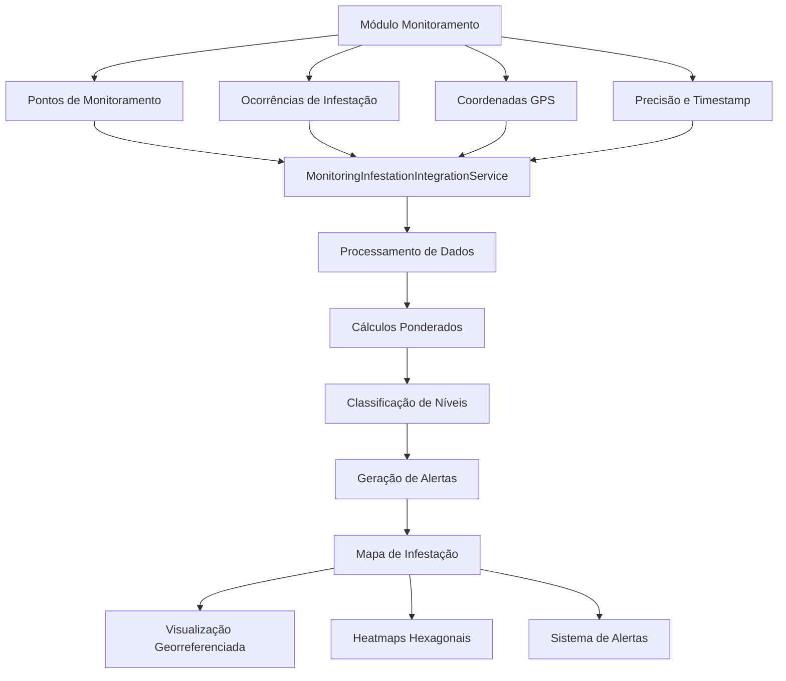
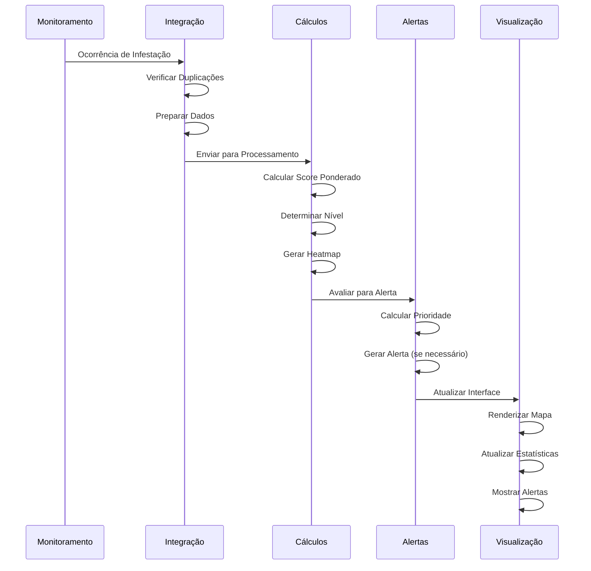

# 🗺️ **DETALHAMENTO COMPLETO: Módulo Mapa de Infestação e Conectividade com Monitoramento**

## 📋 **VISÃO GERAL DO MÓDULO**

O **Módulo Mapa de Infestação** é uma solução completa e avançada para visualização, análise e gestão de dados de infestação agrícola. Ele funciona como uma **camada de inteligência** que processa dados do módulo de monitoramento e os transforma em insights georreferenciados, alertas automáticos e análises preditivas.

### **🎯 Objetivo Principal**
- **Integrar dados reais** do módulo de monitoramento
- **Processar e analisar** ocorrências de pragas, doenças e plantas daninhas
- **Visualizar georreferenciadamente** em mapas interativos
- **Gerar alertas automáticos** baseados em thresholds do catálogo de organismos
- **Fornecer insights** para tomada de decisão agronômica

---

## 🏗️ **ARQUITETURA E ESTRUTURA**

### **📁 Estrutura de Pastas**
```
lib/modules/infestation_map/
├── models/                    # Modelos de dados
│   ├── infestation_summary.dart      # Resumos de infestação
│   ├── infestation_alert.dart        # Alertas automáticos
│   ├── infestation_level.dart        # Níveis de severidade
│   ├── infestation_filters.dart      # Filtros de consulta
│   └── alert_status.dart             # Status dos alertas
├── services/                  # Lógica de negócio
│   ├── infestation_calculation_service.dart    # Cálculos ponderados
│   ├── hexbin_service.dart                    # Heatmaps hexagonais
│   ├── alert_service.dart                     # Sistema de alertas
│   ├── organism_catalog_integration_service.dart  # Integração catálogo
│   └── talhao_integration_service.dart        # Integração talhões
├── repositories/              # Persistência de dados
│   └── infestation_repository.dart    # Repositório principal
├── screens/                   # Interface do usuário
│   └── infestation_map_screen.dart    # Tela principal do mapa
├── widgets/                   # Componentes reutilizáveis
│   ├── infestation_legend_widget.dart # Legenda de níveis
│   ├── infestation_filters_panel.dart # Painel de filtros
│   ├── infestation_stats_card.dart    # Card de estatísticas
│   └── alerts_panel.dart              # Painel de alertas
├── utils/                     # Utilitários
│   └── infestation_test_runner.dart   # Testes de integração
└── README.md                  # Documentação
```

---

## 🔗 **CONECTIVIDADE COM MÓDULO DE MONITORAMENTO**

### **📊 Fluxo de Integração**



### **🔄 Serviço de Integração Principal**

#### **`MonitoringInfestationIntegrationService`**
```dart
/// Serviço central de integração entre Monitoramento e Mapa de Infestação
class MonitoringInfestationIntegrationService {
  /// Envia dados de monitoramento para o mapa de infestação
  Future<bool> sendMonitoringDataToInfestationMap({
    required InfestacaoModel occurrence,
    String? sessionId,
    bool preventDuplicates = true,
  });
  
  /// Envia múltiplas ocorrências de uma vez
  Future<Map<String, bool>> sendMultipleMonitoringData({
    required List<InfestacaoModel> occurrences,
    String? sessionId,
    bool preventDuplicates = true,
  });
  
  /// Sincroniza dados pendentes
  Future<void> syncPendingInfestationData();
  
  /// Limpa duplicações
  Future<void> cleanDuplicateInfestationRecords();
  
  /// Exporta dados integrados
  Future<File> exportIntegrationData({
    String format = 'geojson',
    int? talhaoId,
    String? organismoId,
    DateTime? startDate,
    DateTime? endDate,
  });
}
```

### **📋 Tabelas de Integração**

#### **1. Tabela `infestation_map`**
```sql
CREATE TABLE infestation_map (
  id TEXT PRIMARY KEY,
  talhao_id INTEGER NOT NULL,
  ponto_id INTEGER NOT NULL,
  latitude REAL NOT NULL,
  longitude REAL NOT NULL,
  tipo_ocorrencia TEXT NOT NULL,
  subtipo_ocorrencia TEXT NOT NULL,
  nivel_ocorrencia TEXT NOT NULL,
  percentual_ocorrencia INTEGER NOT NULL,
  observacao TEXT,
  foto_paths TEXT,
  data_hora_ocorrencia DATETIME NOT NULL,
  data_hora_monitoramento DATETIME NOT NULL,
  sincronizado INTEGER DEFAULT 0,
  created_at DATETIME DEFAULT CURRENT_TIMESTAMP,
  updated_at DATETIME DEFAULT CURRENT_TIMESTAMP
);
```

#### **2. Tabela `monitoring_history`**
```sql
CREATE TABLE monitoring_history (
  id TEXT PRIMARY KEY,
  talhao_id INTEGER NOT NULL,
  ponto_id INTEGER NOT NULL,
  cultura_id INTEGER NOT NULL,
  cultura_nome TEXT NOT NULL,
  talhao_nome TEXT NOT NULL,
  latitude REAL NOT NULL,
  longitude REAL NOT NULL,
  tipo_ocorrencia TEXT NOT NULL,
  subtipo_ocorrencia TEXT NOT NULL,
  nivel_ocorrencia TEXT NOT NULL,
  percentual_ocorrencia INTEGER NOT NULL,
  observacao TEXT,
  foto_paths TEXT,
  data_hora_ocorrencia DATETIME NOT NULL,
  data_hora_monitoramento DATETIME NOT NULL,
  sincronizado INTEGER DEFAULT 0,
  created_at DATETIME DEFAULT CURRENT_TIMESTAMP,
  updated_at DATETIME DEFAULT CURRENT_TIMESTAMP
);
```

---

## 🧮 **SISTEMA DE CÁLCULOS AVANÇADOS**

### **📊 InfestationCalculationService**

#### **Algoritmos Ponderados**
```dart
class InfestationCalculationService {
  // Constantes para cálculos
  static const double _defaultTau = 14.0; // dias para decay exponencial
  static const double _minAccuracyWeight = 0.5; // peso mínimo para precisão GPS
  static const double _maxAccuracyWeight = 1.0; // peso máximo para precisão GPS
  
  /// Converte quantidade para percentual baseado na unidade
  double pctFromQuantity({
    required int quantity,
    required String unidade,
    required OrganismCatalog org,
    required int totalPlantas,
  });
  
  /// Determina nível de infestação baseado no percentual
  Future<String> levelFromPct(double pct, {required String organismoId});
  
  /// Calcula score composto ponderado
  Future<CompositeScoreResult> calculateCompositeScore({
    required List<MonitoringPoint> points,
    required String organismoId,
    required List<LatLng> polygonBounds,
    bool generateHexbin = false,
  });
}
```

#### **Fatores de Peso**
1. **Precisão GPS**: Pontos com maior precisão têm maior peso
2. **Recência**: Dados mais recentes têm maior influência
3. **Densidade**: Concentração de pontos na área
4. **Thresholds do Catálogo**: Limites específicos por organismo

### **🔷 Sistema de Heatmaps Hexagonais**

#### **HexbinService**
```dart
class HexbinService {
  /// Gera dados de hexbin para visualização de densidade
  Future<List<HexbinData>> generateHexbinData(
    List<MonitoringPoint> points, {
    required List<LatLng> polygonBounds,
    double hexSize = 50.0, // metros
    String? organismoId,
  });
  
  /// Calcula valores de infestação por hexágono
  List<HexbinData> _calculateHexagonInfestationValues(
    Map<String, List<MonitoringPoint>> hexbinData,
  );
}
```

#### **Características dos Heatmaps**
- **Tamanho Adaptativo**: Hexágonos ajustados automaticamente
- **Cores Térmicas**: Verde → Amarelo → Laranja → Vermelho
- **GeoJSON**: Exportação em formato padrão
- **Filtros por Organismo**: Heatmaps específicos por praga/doença

---

## 🚨 **SISTEMA DE ALERTAS AUTOMÁTICOS**

### **📢 AlertService**

#### **Geração Automática de Alertas**
```dart
class AlertService {
  /// Gera alertas automáticos baseados nos resumos
  Future<List<InfestationAlert>> generateAutomaticAlerts(
    List<InfestationSummary> summaries,
  );
  
  /// Avalia resumo para determinar se deve gerar alerta
  Future<InfestationAlert?> _evaluateSummaryForAlert(
    InfestationSummary summary,
  );
  
  /// Calcula score de prioridade
  Future<double> _calculatePriorityScore(InfestationSummary summary);
}
```

#### **Ciclo de Vida dos Alertas**
1. **Ativo** → Alerta gerado automaticamente
2. **Reconhecido** → Usuário confirma recebimento
3. **Resolvido** → Problema tratado/controlado

#### **Critérios de Geração**
- **Nível Crítico**: Infestação ≥ 75%
- **Nível Alto**: Infestação ≥ 50%
- **Tendência Crescente**: Aumento nos últimos 7 dias
- **Densidade de Pontos**: Múltiplas ocorrências na área

### **📊 Priorização Inteligente**
```dart
/// Score de prioridade baseado em múltiplos fatores
double priorityScore = (
  levelWeight * 0.4 +           // Peso do nível (40%)
  trendWeight * 0.3 +           // Peso da tendência (30%)
  severityWeight * 0.2 +        // Peso da severidade (20%)
  recencyWeight * 0.1           // Peso da recência (10%)
);
```

---

## 🗺️ **VISUALIZAÇÃO E MAPAS**

### **📱 InfestationMapScreen**

#### **Funcionalidades Principais**
```dart
class InfestationMapScreen extends StatefulWidget {
  // Controles de visualização
  bool _showHeatmap = true;      // Heatmaps hexagonais
  bool _showPoints = true;       // Pontos individuais
  bool _showPolygons = true;     // Polígonos de talhões
  
  // Dados do mapa
  List<InfestationSummary> _infestationSummaries = [];
  List<InfestationAlert> _activeAlerts = [];
  List<TalhaoModel> _talhoes = [];
  List<OrganismCatalog> _organisms = [];
}
```

#### **Camadas do Mapa**
1. **TileLayer**: Mapas base (satélite, terreno, híbrido)
2. **PolygonLayer**: Polígonos dos talhões
3. **MarkerLayer**: Pontos de infestação
4. **HeatmapLayer**: Heatmaps hexagonais

#### **Controles de Navegação**
- **Zoom**: Controles de zoom in/out
- **Pan**: Navegação por arrastar
- **Centrar**: Botão para centralizar no usuário
- **Modo Satélite**: Alternância entre visualizações

### **🎨 Sistema de Cores**

#### **Níveis de Infestação**
```dart
// Cores baseadas no nível de severidade
Color getInfestationColor(String level) {
  switch (level) {
    case 'BAIXO': return Colors.green;
    case 'MODERADO': return Colors.yellow;
    case 'ALTO': return Colors.orange;
    case 'CRÍTICO': return Colors.red;
    default: return Colors.grey;
  }
}
```

#### **Heatmaps Térmicos**
- **Verde**: Baixa infestação (0-25%)
- **Amarelo**: Infestação moderada (25-50%)
- **Laranja**: Infestação alta (50-75%)
- **Vermelho**: Infestação crítica (75-100%)

---

## 🔍 **FILTROS E CONSULTAS**

### **📋 InfestationFilters**

#### **Filtros Disponíveis**
```dart
class InfestationFilters {
  DateTime? startDate;           // Data início
  DateTime? endDate;             // Data fim
  List<String> levels;           // Níveis de infestação
  List<String> organisms;        // Organismos específicos
  List<String> talhoes;          // Talhões específicos
  List<String> alertStatus;      // Status dos alertas
  bool showOnlyAlerts;           // Apenas com alertas
  bool showOnlyCritical;         // Apenas críticos
}
```

#### **Filtros Avançados**
- **Período**: Seleção de janelas de tempo
- **Níveis**: Filtro por severidade
- **Organismos**: Seleção específica de pragas/doenças
- **Talhões**: Filtro por área específica
- **Alertas**: Filtros por status e tipo

---

## 📊 **ESTATÍSTICAS E MÉTRICAS**

### **📈 Métricas Principais**

#### **Por Talhão**
- **Total de Pontos**: Número de pontos monitorados
- **Pontos com Ocorrência**: Pontos com infestação detectada
- **Taxa de Infestação**: Percentual médio de infestação
- **Nível Predominante**: Nível mais comum na área
- **Última Atualização**: Data do último monitoramento

#### **Por Organismo**
- **Frequência**: Quantas vezes foi detectado
- **Severidade**: Nível médio de infestação
- **Distribuição**: Áreas mais afetadas
- **Tendência**: Crescente, estável ou decrescente

#### **Alertas**
- **Total de Alertas**: Número total gerado
- **Alertas Ativos**: Não reconhecidos
- **Alertas Críticos**: Nível de risco alto
- **Tempo Médio de Resolução**: Eficiência do tratamento

---

## 🔧 **INTEGRAÇÃO COM OUTROS MÓDULOS**

### **🌱 Catálogo de Organismos**
```dart
class OrganismCatalogIntegrationService {
  /// Obtém thresholds específicos do organismo
  Future<Map<String, dynamic>?> getOrganismThresholds(String organismoId);
  
  /// Obtém pesos de risco
  Future<Map<String, double>> getRiskWeights();
  
  /// Obtém informações taxonômicas
  Future<OrganismCatalog?> getOrganismInfo(String organismoId);
}
```

### **🏞️ Talhões**
```dart
class TalhaoIntegrationService {
  /// Obtém coordenadas do centro do talhão
  Future<LatLng?> getTalhaoCenter(String talhaoId);
  
  /// Obtém polígono do talhão
  Future<List<LatLng>?> getTalhaoPolygon(String talhaoId);
  
  /// Obtém informações do talhão
  Future<TalhaoModel?> getTalhaoInfo(String talhaoId);
}
```

### **📍 Monitoramento**
```dart
class MonitoringInfestationIntegrationService {
  /// Envia dados de monitoramento
  Future<bool> sendMonitoringDataToInfestationMap({
    required InfestacaoModel occurrence,
    bool preventDuplicates = true,
  });
  
  /// Sincroniza dados pendentes
  Future<void> syncPendingInfestationData();
  
  /// Limpa duplicações
  Future<void> cleanDuplicateInfestationRecords();
}
```

---

## 🧪 **SISTEMA DE TESTES**

### **🔬 InfestationTestRunner**

#### **Testes de Integração**
```dart
class InfestationTestRunner {
  /// Executa todos os testes de integração
  Future<Map<String, bool>> runAllTests();
  
  /// Testa conexão com banco de dados
  Future<bool> testDatabaseConnection();
  
  /// Testa repositório de infestação
  Future<bool> testInfestationRepository();
  
  /// Testa integração com talhões
  Future<bool> testTalhaoIntegration();
  
  /// Testa integração com catálogo
  Future<bool> testOrganismCatalogIntegration();
  
  /// Testa cálculos de infestação
  Future<bool> testInfestationCalculations();
  
  /// Testa geração de heatmap
  Future<bool> testHeatmapGeneration();
}
```

#### **Execução via Interface**
- **Botão 🐛** na AppBar da tela de mapa
- **Relatório Detalhado** de resultados
- **Logs de Debug** para falhas
- **Estatísticas de Performance**

---

## 📤 **EXPORTAÇÃO DE DADOS**

### **📁 Formatos Suportados**

#### **GeoJSON**
```json
{
  "type": "FeatureCollection",
  "features": [
    {
      "type": "Feature",
      "geometry": {
        "type": "Point",
        "coordinates": [-47.123, -22.456]
      },
      "properties": {
        "talhao_id": "TALHAO_001",
        "organismo": "Lagarta-do-cartucho",
        "nivel": "ALTO",
        "percentual": 65.5,
        "data": "2024-01-15T10:30:00Z"
      }
    }
  ]
}
```

#### **CSV**
```csv
talhao_id,organismo,nivel,percentual,latitude,longitude,data
TALHAO_001,Lagarta-do-cartucho,ALTO,65.5,-22.456,-47.123,2024-01-15 10:30:00
TALHAO_002,Percevejo-marrom,MODERADO,35.2,-22.457,-47.124,2024-01-15 11:15:00
```

### **🔧 Métodos de Exportação**
```dart
/// Exporta dados integrados
Future<File> exportIntegrationData({
  String format = 'geojson',    // 'geojson' ou 'csv'
  int? talhaoId,                // Filtro por talhão
  String? organismoId,          // Filtro por organismo
  DateTime? startDate,          // Data início
  DateTime? endDate,            // Data fim
});
```

---

## 🚀 **PERFORMANCE E OTIMIZAÇÃO**

### **⚡ Sistema de Cache**

#### **InfestationCacheService**
```dart
class InfestationCacheService {
  // Cache de coordenadas (expiração: 6 horas)
  Map<String, LatLng> _talhaoCoordinatesCache = {};
  
  // Cache de thresholds (expiração: 12 horas)
  Map<String, Map<String, dynamic>> _organismThresholdsCache = {};
  
  // Cache de estatísticas (expiração: 1 hora)
  Map<String, List<InfestationSummary>> _statisticsCache = {};
  
  // Cache de heatmap (expiração: 1 hora)
  Map<String, String> _heatmapCache = {};
}
```

#### **Estratégias de Cache**
- **Invalidação Inteligente**: Por talhão, organismo ou completa
- **Expiração Automática**: Baseada em tempo e uso
- **Monitoramento**: Estatísticas de uso e tamanho
- **Limpeza Automática**: Remoção de dados antigos

### **🔧 Otimizações de Performance**
- **Lazy Loading**: Carregamento sob demanda
- **Batch Processing**: Processamento em lotes
- **Indexação**: Índices otimizados no banco
- **Compressão**: Dados comprimidos para cache

---

## 📱 **INTERFACE DO USUÁRIO**

### **🎨 Design System**

#### **Cores FortSmart**
- **Primária**: `#2A4F3D` (Verde escuro)
- **Secundária**: `#3BAA57` (Verde claro)
- **Acentos**: `#0057A3` (Azul)
- **Alertas**: `#FF6B35` (Laranja)

#### **Componentes Reutilizáveis**
- **FortSmartCard**: Cards com sombra e bordas arredondadas
- **InfestationLegend**: Legenda de níveis com cores
- **AlertsPanel**: Painel de gestão de alertas
- **FiltersPanel**: Painel de filtros avançados

### **📱 Layout Responsivo**
- **Mobile First**: Design otimizado para mobile
- **Touch Friendly**: Botões e controles adequados para touch
- **Gestos**: Zoom, pan e tap para interação
- **Orientações**: Suporte a portrait e landscape

---

## 🔄 **FLUXO DE DADOS COMPLETO**

### **📊 Processamento de Dados**



### **🔄 Ciclo de Atualização**
1. **Coleta**: Dados do monitoramento
2. **Processamento**: Cálculos e análises
3. **Classificação**: Níveis e alertas
4. **Visualização**: Mapas e estatísticas
5. **Notificação**: Alertas e recomendações

---

## 🎯 **CASOS DE USO PRINCIPAIS**

### **👨‍🌾 Para o Agricultor**
- **Visualizar Infestações**: Ver onde estão os problemas
- **Receber Alertas**: Notificações automáticas de riscos
- **Acompanhar Tendências**: Evolução das infestações
- **Tomar Decisões**: Baseadas em dados georreferenciados

### **🔬 Para o Agrônomo**
- **Análise Detalhada**: Dados precisos por área
- **Recomendações**: Baseadas em thresholds científicos
- **Relatórios**: Exportação para análise externa
- **Monitoramento**: Acompanhamento contínuo

### **📊 Para a Gestão**
- **Dashboard Executivo**: Visão geral da propriedade
- **KPIs**: Métricas de performance
- **Alertas Críticos**: Situações que requerem atenção
- **Histórico**: Evolução ao longo do tempo

---

## 🔧 **CONFIGURAÇÃO E INSTALAÇÃO**

### **📦 Dependências**
```yaml
dependencies:
  flutter_map: ^5.0.0          # Mapas interativos
  latlong2: ^0.9.0             # Coordenadas geográficas
  uuid: ^3.0.7                 # Identificadores únicos
  sqflite: ^2.3.0              # Banco de dados local
  geolocator: ^10.1.0          # Localização GPS
  http: ^1.1.0                 # Requisições HTTP
```

### **⚙️ Configuração Inicial**
```dart
// 1. Inicializar módulo
await InfestationMapModule.initialize();

// 2. Configurar integração
final integrationService = MonitoringInfestationIntegrationService();
await integrationService.initialize();

// 3. Configurar cache
final cacheService = InfestationCacheService();
await cacheService.initialize();
```

### **🗺️ Configuração de Mapas**
```dart
// MapTiler API (recomendado)
const mapTilerAPIKey = 'YOUR_MAPTILER_API_KEY';

// Fallback para OpenStreetMap
const fallbackMapUrl = 'https://tile.openstreetmap.org/{z}/{x}/{y}.png';
```

---

## 🐛 **SOLUÇÃO DE PROBLEMAS**

### **❌ Problemas Comuns**

#### **Mapa não carrega**
- ✅ Verificar permissões de localização
- ✅ Confirmar conectividade com internet
- ✅ Verificar configuração de tiles
- ✅ Testar API MapTiler

#### **Dados não aparecem**
- ✅ **Verificar módulos dependentes**: Monitoramento, Talhões e Catálogo
- ✅ **Confirmar dados reais**: Verificar se há dados de monitoramento
- ✅ **Verificar integração**: Confirmar conexão entre módulos
- ✅ **Confirmar filtros**: Verificar se filtros não estão restritivos
- ✅ **Verificar permissões**: Confirmar acesso aos módulos

#### **Performance lenta**
- ✅ Reduzir tamanho de hexágonos
- ✅ Limitar período de dados
- ✅ Usar cache de heatmaps
- ✅ Otimizar consultas ao banco

#### **Alertas não geram**
- ✅ Verificar thresholds no catálogo
- ✅ Confirmar dados de monitoramento
- ✅ Verificar configurações de alerta
- ✅ Testar cálculos de infestação

### **🔧 Ferramentas de Debug**

#### **Testes de Integração**
```dart
// Executar via interface
final testRunner = InfestationTestRunner();
final results = await testRunner.runAllTests();

// Verificar logs
Logger.info('Teste executado: ${results['database_connection']}');
```

#### **Logs de Debug**
```dart
// Habilitar logs detalhados
Logger.setLevel(LogLevel.debug);

// Verificar integração
Logger.info('🔄 [INTEGRATION] Enviando dados...');
Logger.info('📊 [INTEGRATION] Ocorrência: ${occurrence.id}');
```

---

## 📈 **ROADMAP E FUTURAS MELHORIAS**

### **🚀 Versão 1.1**
- [ ] **Cache de Heatmaps**: Otimização de performance
- [ ] **Exportação de Relatórios**: PDF e Excel
- [ ] **Notificações Push**: Alertas em tempo real
- [ ] **Histórico de Alertas**: Rastreamento completo

### **🔮 Versão 1.2**
- [ ] **Análise de Tendências**: Predição de infestações
- [ ] **Recomendações Automáticas**: Baseadas em IA
- [ ] **Integração com Prescrição**: Conexão com aplicações
- [ ] **Dashboard Executivo**: Visão gerencial

### **🤖 Versão 2.0**
- [ ] **Machine Learning**: Predição avançada
- [ ] **Análise de Imagens**: Reconhecimento visual
- [ ] **Integração com Drones**: Dados aéreos
- [ ] **IoT Integration**: Sensores em tempo real

---

## 📞 **SUPORTE E DOCUMENTAÇÃO**

### **📚 Recursos Disponíveis**
- **README.md**: Documentação completa do módulo
- **Testes de Integração**: Validação automática
- **Logs Detalhados**: Debug e monitoramento
- **Exemplos de Código**: Implementações de referência

### **🔧 Manutenção**
- **Atualizações Automáticas**: Cache e índices
- **Limpeza de Dados**: Remoção de registros antigos
- **Backup**: Preservação de dados importantes
- **Monitoramento**: Estatísticas de uso e performance

---

## 🎉 **CONCLUSÃO**

O **Módulo Mapa de Infestação** representa uma solução completa e avançada para gestão de infestações agrícolas, oferecendo:

### **✅ Funcionalidades Implementadas**
- ✅ **Integração Completa** com módulo de monitoramento
- ✅ **Cálculos Avançados** com algoritmos ponderados
- ✅ **Heatmaps Hexagonais** para visualização de densidade
- ✅ **Sistema de Alertas** automático e inteligente
- ✅ **Visualização Georreferenciada** em mapas interativos
- ✅ **Filtros Avançados** para análise detalhada
- ✅ **Exportação de Dados** em múltiplos formatos
- ✅ **Sistema de Cache** para otimização de performance
- ✅ **Testes de Integração** para validação contínua

### **🚀 Benefícios para o Usuário**
- **Visão Georreferenciada**: Localização precisa dos problemas
- **Alertas Inteligentes**: Notificações automáticas de riscos
- **Análise Científica**: Baseada em thresholds do catálogo
- **Tomada de Decisão**: Dados precisos para ações
- **Eficiência Operacional**: Redução de tempo e custos
- **Qualidade dos Dados**: Integração com módulos existentes

### **🔗 Conectividade Robusta**
- **Monitoramento**: Dados reais de ocorrências
- **Talhões**: Coordenadas e polígonos precisos
- **Catálogo**: Thresholds e pesos científicos
- **Sincronização**: Dados sempre atualizados
- **Prevenção de Duplicações**: Integridade dos dados

**🎯 O módulo está pronto para uso em produção, oferecendo uma solução completa e integrada para gestão de infestações agrícolas com dados reais e análises científicas!**
