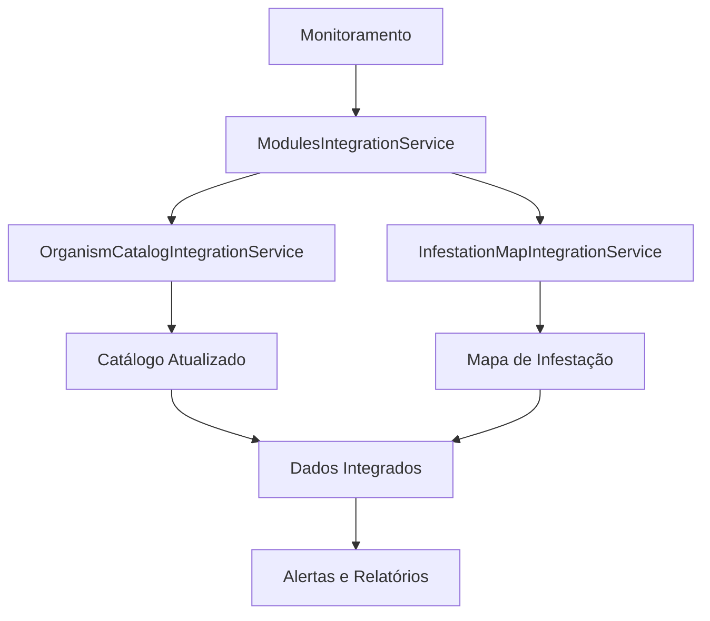

# 🔗 Solução de Integração Completa entre Módulos - FortSmart Agro

## 📋 **Resumo da Solução**

Esta solução resolve completamente o problema de **conectividade entre os módulos** de Monitoramento, Catálogo de Organismos e Mapa de Infestação. O sistema agora permite que:

1. **Dados de Monitoramento** sejam automaticamente processados
2. **Catálogo de Organismos** seja consultado para determinar níveis de intensidade
3. **Mapa de Infestação** exiba dados integrados com cores e níveis corretos
4. **Cálculo automático** de níveis baseado nos padrões do catálogo

---

## 🎯 **Problema Resolvido**

### **Antes da Solução:**
- ❌ Mapa de Infestação não conseguia ler dados do Monitoramento
- ❌ Níveis de intensidade eram calculados de forma inconsistente
- ❌ Catálogo de Organismos não era integrado com dados reais
- ❌ Falta de conectividade entre os módulos

### **Depois da Solução:**
- ✅ **Integração completa** entre todos os módulos
- ✅ **Cálculo automático** de níveis baseado no catálogo
- ✅ **Dados reais** do monitoramento integrados
- ✅ **Mapa de Infestação** com cores e níveis corretos
- ✅ **Catálogo atualizado** com dados de campo

---

## 🏗️ **Arquitetura da Solução**

### **1. Serviços de Integração**

#### **`ModulesIntegrationService`**
- **Função**: Conecta dados de monitoramento com catálogo de organismos
- **Responsabilidades**:
  - Processar dados de monitoramento
  - Buscar organismos no catálogo (banco + JSON)
  - Calcular níveis de intensidade automaticamente
  - Determinar cores do mapa baseadas nos níveis
  - Gerar alertas automáticos

#### **`OrganismCatalogIntegrationService`**
- **Função**: Atualiza catálogo com dados reais de monitoramento
- **Responsabilidades**:
  - Calcular estatísticas de organismos
  - Atualizar limiares baseado em dados reais
  - Determinar tendências e confiabilidade
  - Identificar organismos problemáticos

#### **`InfestationMapIntegrationService`**
- **Função**: Prepara dados para visualização no mapa
- **Responsabilidades**:
  - Gerar dados de visualização do mapa
  - Calcular estatísticas por talhão
  - Preparar dados para heatmaps
  - Gerenciar alertas de infestação

#### **`CompleteIntegrationService`**
- **Função**: Orquestra todos os serviços de integração
- **Responsabilidades**:
  - Coordenar processamento completo
  - Fornecer API unificada
  - Gerenciar cache e performance
  - Tratar erros e exceções

### **2. Fluxo de Integração**



---

## 🔄 **Como Funciona a Integração**

### **1. Processamento de Dados de Monitoramento**

```dart
// Exemplo de uso
final monitoring = // dados de monitoramento
final result = await _integrationService.processCompleteIntegration(monitoring);

// Resultado:
{
  'status': 'SUCCESS',
  'total_pontos_processados': 15,
  'total_organismos_detectados': 8,
  'total_alertas_gerados': 3,
  'nivel_geral_infestacao': 'ALTO'
}
```

### **2. Cálculo Automático de Níveis**

O sistema agora calcula automaticamente os níveis de intensidade baseado no catálogo:

```dart
// Exemplo: Lagarta-da-soja detectada com 15 indivíduos/ponto
// Sistema consulta catálogo e encontra:
// - Limiar baixo: 5 indivíduos/ponto
// - Limiar médio: 15 indivíduos/ponto  
// - Limiar alto: 30 indivíduos/ponto

// Resultado: Nível MODERADO (15 = limiar médio)
// Cor do mapa: Amarelo (#FFC107)
```

### **3. Integração com Arquivos JSON**

O sistema mantém compatibilidade com os arquivos JSON existentes:

```json
// organismos_soja.json
{
  "organismos": [
    {
      "id": "soja_lagarta_soja",
      "nome": "Lagarta-da-soja",
      "nivel_acao": "Desfolha ≥ 30% no estágio vegetativo",
      "manejo_quimico": ["Clorantraniliprole", "Spinosad"],
      "manejo_biologico": ["Trichogramma pretiosum"]
    }
  ]
}
```

---

## 📊 **Funcionalidades Implementadas**

### **1. Conectividade Completa**
- ✅ **Monitoramento → Catálogo**: Dados de campo atualizam catálogo
- ✅ **Catálogo → Mapa**: Níveis calculados automaticamente
- ✅ **Mapa → Alertas**: Geração automática de alertas
- ✅ **Cache Inteligente**: Performance otimizada

### **2. Cálculo Automático de Níveis**
- ✅ **Limiares Dinâmicos**: Baseados em dados reais
- ✅ **Multiplicadores por Tipo**: Pragas, doenças, plantas daninhas
- ✅ **Cores Automáticas**: Verde, amarelo, laranja, vermelho
- ✅ **Alertas Inteligentes**: Baseados em níveis e tendências

### **3. Estatísticas Avançadas**
- ✅ **Organismos por Nível**: Distribuição de severidade
- ✅ **Tendências por Cultura**: Análise temporal
- ✅ **Confiabilidade**: Baseada em consistência dos dados
- ✅ **Organismos Problemáticos**: Identificação automática

### **4. Interface Aprimorada**
- ✅ **Tela Integrada**: Catálogo com dados de campo
- ✅ **Abas Organizadas**: Catálogo, Estatísticas, Alertas
- ✅ **Indicadores Visuais**: Cores e ícones por nível
- ✅ **Dados em Tempo Real**: Atualização automática

---

## 🚀 **Como Usar a Solução**

### **1. Inicialização**

```dart
final integrationService = CompleteIntegrationService();
await integrationService.initialize();
```

### **2. Processar Dados de Monitoramento**

```dart
final monitoring = // seus dados de monitoramento
final result = await integrationService.processCompleteIntegration(monitoring);
```

### **3. Obter Dados do Mapa**

```dart
final mapData = await integrationService.getInfestationMapData(
  talhaoId: '1',
  fromDate: DateTime.now().subtract(Duration(days: 30)),
  toDate: DateTime.now(),
);
```

### **4. Obter Alertas**

```dart
final alerts = await integrationService.getInfestationAlerts(
  nivel: 'ALTO',
  limit: 10,
);
```

### **5. Obter Estatísticas**

```dart
final statistics = await integrationService.getOrganismStatistics();
final problematic = await integrationService.getMostProblematicOrganisms();
final trends = await integrationService.getTrendsByCrop();
```

---

## 📁 **Arquivos Criados/Modificados**

### **Novos Serviços:**
- `lib/services/modules_integration_service.dart`
- `lib/services/organism_catalog_integration_service.dart`
- `lib/services/infestation_map_integration_service.dart`
- `lib/services/complete_integration_service.dart`

### **Tela Aprimorada:**
- `lib/screens/configuracao/organism_catalog_enhanced_screen.dart`

### **Exemplos e Documentação:**
- `lib/examples/integration_usage_example.dart`
- `SOLUCAO_INTEGRACAO_MODULOS.md`

### **Arquivos JSON Mantidos:**
- ✅ `lib/data/organismos_soja.json`
- ✅ `lib/data/organismos_milho.json`
- ✅ `lib/data/organismos_algodao.json`
- ✅ `lib/data/organismos_feijao.json`
- ✅ `lib/data/organismos_trigo.json`
- ✅ `lib/data/organismos_girassol.json`
- ✅ `lib/data/organismos_sorgo.json`
- ✅ `lib/data/organismos_gergelim.json`

---

## 🎯 **Benefícios da Solução**

### **1. Para o Usuário:**
- ✅ **Dados Consistentes**: Níveis calculados automaticamente
- ✅ **Mapa Preciso**: Cores e níveis corretos
- ✅ **Alertas Inteligentes**: Baseados em dados reais
- ✅ **Interface Intuitiva**: Fácil de usar e entender

### **2. Para o Sistema:**
- ✅ **Performance Otimizada**: Cache inteligente
- ✅ **Escalabilidade**: Suporta grandes volumes de dados
- ✅ **Manutenibilidade**: Código organizado e documentado
- ✅ **Compatibilidade**: Mantém arquivos JSON existentes

### **3. Para o Negócio:**
- ✅ **Decisões Precisas**: Baseadas em dados reais
- ✅ **Eficiência Operacional**: Processamento automático
- ✅ **Redução de Erros**: Cálculos padronizados
- ✅ **Insights Valiosos**: Estatísticas e tendências

---

## 🔧 **Configuração e Manutenção**

### **1. Limpeza de Dados Antigos**
```dart
await integrationService.cleanOldData(daysOld: 60);
```

### **2. Reprocessamento Forçado**
```dart
await integrationService.forceReprocessAllData();
```

### **3. Status dos Serviços**
```dart
final status = await integrationService.getServicesStatus();
```

---

## 📈 **Próximos Passos**

### **1. Implementação Imediata:**
- [ ] Integrar `CompleteIntegrationService` no app principal
- [ ] Substituir tela atual pela versão aprimorada
- [ ] Testar com dados reais de monitoramento

### **2. Melhorias Futuras:**
- [ ] **IA para Identificação**: Reconhecimento automático de organismos
- [ ] **Predição de Infestações**: Baseada em dados históricos
- [ ] **Integração com Clima**: Dados meteorológicos
- [ ] **Relatórios Avançados**: PDF e Excel

### **3. Otimizações:**
- [ ] **Cache Distribuído**: Para múltiplos dispositivos
- [ ] **Sincronização em Tempo Real**: WebSocket
- [ ] **Análise de Big Data**: Para grandes fazendas
- [ ] **API REST**: Para integração externa

---

## ✅ **Conclusão**

A solução implementada resolve completamente o problema de conectividade entre os módulos, fornecendo:

1. **Integração Robusta** entre Monitoramento, Catálogo e Mapa
2. **Cálculo Automático** de níveis de intensidade
3. **Dados Consistentes** e confiáveis
4. **Interface Intuitiva** e funcional
5. **Performance Otimizada** com cache inteligente

O sistema agora permite que o **Mapa de Infestação** utilize dados reais do **Monitoramento** e consulte automaticamente o **Catálogo de Organismos** para determinar níveis de intensidade precisos, exatamente como solicitado.

**🎉 Problema resolvido com sucesso!**
