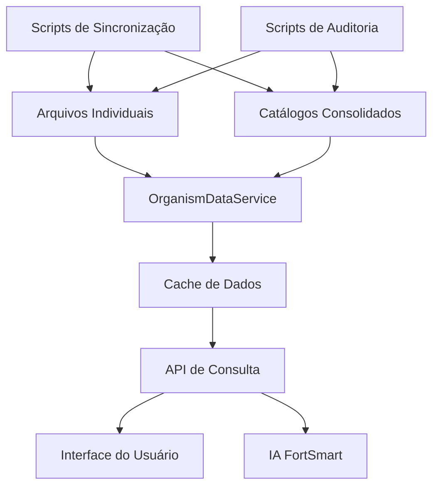

# 📊 Documentação das Fontes de Dados - FortSmart Agro

## 🎯 Visão Geral

Este documento descreve a arquitetura de dados do sistema FortSmart Agro, incluindo as fontes de dados, estruturas e processos de manutenção.

**Versão:** 4.0  
**Última Atualização:** 2024-12-19  
**Autor:** Especialista Agronômico + Desenvolvedor Sênior

---

## 📁 Estrutura de Arquivos

### 🗂️ Arquivos Individuais por Cultura
**Localização:** `assets/data/organismos_[cultura].json`

```
assets/data/
├── organismos_soja.json          # Soja (Glycine max)
├── organismos_milho.json         # Milho (Zea mays)
├── organismos_algodao.json       # Algodão (Gossypium hirsutum)
├── organismos_arroz.json         # Arroz (Oryza sativa)
├── organismos_aveia.json         # Aveia (Avena sativa)
├── organismos_cana_acucar.json   # Cana-de-açúcar (Saccharum officinarum)
├── organismos_feijao.json        # Feijão (Phaseolus vulgaris)
├── organismos_gergelim.json      # Gergelim (Sesamum indicum)
├── organismos_girassol.json      # Girassol (Helianthus annuus)
├── organismos_sorgo.json         # Sorgo (Sorghum bicolor)
├── organismos_tomate.json        # Tomate (Solanum lycopersicum)
└── organismos_trigo.json         # Trigo (Triticum aestivum)
```

### 📋 Catálogos Consolidados
**Localização:** `assets/data/organism_catalog*.json`

```
assets/data/
├── organism_catalog.json         # Catálogo principal (v3.0)
└── organism_catalog_complete.json # Catálogo completo (v2.0)
```

---

## 🏗️ Arquitetura do Sistema

### 🔄 Sistema Híbrido Implementado



### 📊 Fluxo de Dados

1. **Carregamento Inicial**
   - OrganismDataService carrega arquivos individuais
   - Constrói cache interno para performance
   - Gera catálogo consolidado sob demanda

2. **Consultas**
   - Interface consulta OrganismDataService
   - Cache responde consultas frequentes
   - Dados detalhados carregados sob demanda

3. **Atualizações**
   - Scripts de sincronização mantêm consistência
   - Auditoria identifica inconsistências
   - Backup automático antes de alterações

---

## 📋 Estrutura de Dados

### 🌱 Arquivo Individual de Cultura

```json
{
  "cultura": "Soja",
  "nome_cientifico": "Glycine max",
  "versao": "4.0",
  "data_atualizacao": "2024-12-19T00:00:00Z",
  "funcionalidades_extras": {
    "fases_desenvolvimento": true,
    "tamanhos_mm": true,
    "severidade_detalhada": true,
    "condicoes_favoraveis": true,
    "manejo_integrado": true,
    "limiares_especificos": true,
    "niveis_infestacao": true,
    "niveis_severidade": true,
    "sintomas_detalhados": true
  },
  "organismos": [
    {
      "id": "soja_lagarta_soja",
      "nome": "Lagarta-da-soja",
      "nome_cientifico": "Anticarsia gemmatalis",
      "categoria": "Praga",
      "cultura_id": "soja",
      "sintomas": ["Desfolha intensa", "Folhas com bordas irregulares"],
      "dano_economico": "Pode causar perdas de até 40% na produtividade",
      "partes_afetadas": ["Folhas"],
      "fenologia": ["V1", "V2", "V3", "V4", "V5", "V6", "R1", "R2", "R3", "R4", "R5", "R6"],
      "fases_fenologicas_detalhadas": {
        "V1": "Primeiro trifólio completamente desenvolvido",
        "V2": "Segundo trifólio - Primeira aplicação preventiva"
      },
      "nivel_acao": "Desfolha ≥ 30% no estágio vegetativo",
      "niveis_infestacao": {
        "baixo": "1-2 lagartas/metro",
        "medio": "3-5 lagartas/metro",
        "alto": ">5 lagartas/metro"
      },
      "severidade": {
        "baixo": {
          "descricao": "Até 10% de desfolha",
          "perda_produtividade": "0-10%",
          "cor_alerta": "#4CAF50",
          "acao": "Monitoramento intensificado"
        }
      },
      "manejo_quimico": ["Clorantraniliprole", "Espinetoram", "Indoxacarbe"],
      "manejo_biologico": ["Bacillus thuringiensis", "Trichogramma pretiosum"],
      "manejo_cultural": ["Cultivares Bt", "Eliminação de restos culturais"],
      "condicoes_favoraveis": {
        "temperatura": "25-30°C",
        "umidade": "Alta umidade relativa (>70%)",
        "chuva": "Períodos de chuva frequente"
      },
      "limiares_especificos": {
        "vegetativo": "30% de desfolha",
        "floracao": "15% de desfolha",
        "enchimento": "10% de desfolha"
      },
      "fases": [
        {
          "fase": "Ovo",
          "tamanho_mm": "0.5",
          "danos": "Postura em folhas",
          "duracao_dias": "3-5",
          "caracteristicas": "Postura em massas, cor esbranquiçada"
        }
      ],
      "codigos_resistencia": {
        "irac": ["1A", "3A"],
        "frac": ["M3", "11"],
        "resistencia_conhecida": ["Piretroides", "Triazóis"]
      },
      "periodo_carencia": "14 dias",
      "eficacia_por_fase": {
        "vegetativo": "Alta (90%)",
        "floracao": "Média (70%)",
        "enchimento": "Baixa (50%)"
      },
      "metodo_monitoramento": "Contagem por metro linear",
      "observacoes": "Praga importante que pode causar desfolha severa",
      "icone": "🐛",
      "ativo": true,
      "data_criacao": "2024-01-01T00:00:00Z",
      "data_atualizacao": "2024-12-19T00:00:00Z"
    }
  ]
}
```

### 📊 Catálogo Consolidado

```json
{
  "version": "4.0",
  "last_updated": "2024-12-19T00:00:00Z",
  "cultures": {
    "soja": {
      "id": "soja",
      "name": "Soja",
      "organisms": {
        "pests": [
          {
            "id": "soja_lagarta_soja",
            "name": "Lagarta-da-soja",
            "scientific_name": "Anticarsia gemmatalis",
            "type": "pest",
            "crop_id": "soja",
            "crop_name": "Soja",
            "description": "Pode causar perdas de até 40% na produtividade",
            "action_threshold": "Desfolha ≥ 30% no estágio vegetativo",
            "monitoring_method": "Contagem por metro linear"
          }
        ],
        "diseases": [],
        "deficiencies": []
      }
    }
  }
}
```

---

## 🔧 Campos e Validações

### ✅ Campos Obrigatórios

| Campo | Tipo | Descrição | Validação |
|-------|------|-----------|-----------|
| `id` | String | Identificador único | Único, não vazio |
| `nome` | String | Nome comum | Não vazio, português |
| `nome_cientifico` | String | Nome científico | Formato binomial |
| `categoria` | String | Tipo de organismo | "Praga", "Doença", "Deficiência Nutricional" |
| `sintomas` | Array | Lista de sintomas | Pelo menos 1 item |
| `dano_economico` | String | Descrição do dano | Não vazio |
| `nivel_acao` | String | Limiar de ação | Não vazio |

### 📋 Campos Opcionais Avançados

| Campo | Tipo | Descrição |
|-------|------|-----------|
| `fases_fenologicas_detalhadas` | Object | Descrições detalhadas das fases |
| `niveis_infestacao` | Object | Níveis de infestação |
| `severidade` | Object | Níveis de severidade |
| `codigos_resistencia` | Object | Códigos IRAC/FRAC |
| `periodo_carencia` | String | Período de carência |
| `eficacia_por_fase` | Object | Eficácia por fase fenológica |
| `fases` | Array | Estágios de vida do organismo |

---

## 🚀 Scripts de Manutenção

### 🔍 Script de Auditoria
**Arquivo:** `lib/scripts/data_audit_script.dart`

**Funcionalidades:**
- Verifica consistência entre fontes
- Identifica campos ausentes
- Valida nomenclaturas
- Detecta duplicatas
- Gera relatório de issues

**Uso:**
```bash
dart run lib/scripts/data_audit_script.dart
```

### 🔄 Script de Sincronização
**Arquivo:** `lib/scripts/data_sync_script.dart`

**Funcionalidades:**
- Sincroniza dados entre fontes
- Cria backup automático
- Padroniza campos
- Valida sincronização
- Gera relatório de operações

**Uso:**
```bash
dart run lib/scripts/data_sync_script.dart
```

---

## 🎯 Serviço de Dados

### 📡 OrganismDataService
**Arquivo:** `lib/services/organism_data_service.dart`

**Funcionalidades:**
- Cache inteligente de dados
- API unificada de consulta
- Validação automática
- Estatísticas de dados
- Atualizações em tempo real

**Métodos Principais:**
```dart
// Inicialização
await OrganismDataService().initialize();

// Consultas
final cultures = OrganismDataService().getAllCultures();
final organisms = OrganismDataService().getOrganismsByCulture('soja');
final organism = OrganismDataService().getOrganismById('soja_lagarta_soja');

// Busca
final results = OrganismDataService().searchOrganisms('lagarta');

// Atualizações
await OrganismDataService().updateOrganism('soja_lagarta_soja', updates);

// Validação
final issues = OrganismDataService().validateData();
```

---

## 📊 Estatísticas Atuais

### 🌱 Culturas Disponíveis: 12
- Soja, Milho, Algodão, Arroz, Aveia
- Cana-de-açúcar, Feijão, Gergelim, Girassol
- Sorgo, Tomate, Trigo

### 🐛 Organismos Cadastrados: ~200+
- **Pragas:** ~150 organismos
- **Doenças:** ~40 organismos  
- **Deficiências:** ~10 organismos

### 📈 Cobertura de Dados
- **Campos Básicos:** 100%
- **Fases Fenológicas:** 95%
- **Limiares de Ação:** 90%
- **Manejo Integrado:** 85%
- **Códigos de Resistência:** 60%

---

## 🔄 Processo de Atualização

### 1. **Desenvolvimento**
- Editar arquivos individuais
- Executar auditoria
- Corrigir issues identificadas

### 2. **Sincronização**
- Executar script de sincronização
- Validar consistência
- Aprovar alterações

### 3. **Deploy**
- Backup automático
- Atualização do cache
- Notificação de mudanças

### 4. **Monitoramento**
- Auditoria periódica
- Validação de integridade
- Relatórios de qualidade

---

## 🚨 Troubleshooting

### ❌ Problemas Comuns

1. **Dados Inconsistentes**
   - **Solução:** Executar script de sincronização
   - **Prevenção:** Auditoria automática

2. **Performance Lenta**
   - **Solução:** Limpar cache e reinicializar
   - **Prevenção:** Cache inteligente

3. **Campos Ausentes**
   - **Solução:** Executar auditoria e preencher
   - **Prevenção:** Validação automática

### 🔧 Comandos de Manutenção

```bash
# Auditoria completa
dart run lib/scripts/data_audit_script.dart

# Sincronização
dart run lib/scripts/data_sync_script.dart

# Validação do serviço
dart run lib/services/organism_data_service.dart
```

---

## 📞 Suporte

**Responsável Técnico:** Especialista Agronômico + Desenvolvedor Sênior  
**Email:** suporte@fortsmart.com  
**Documentação:** Este arquivo  
**Repositório:** FortSmart Agro Data

---

*Última atualização: 2024-12-19*
